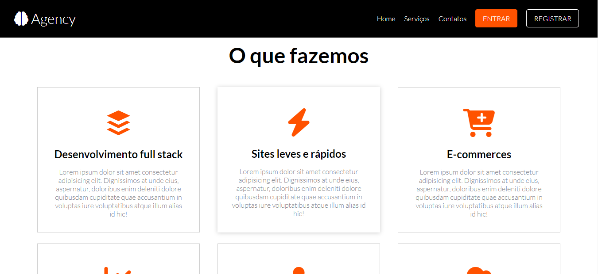
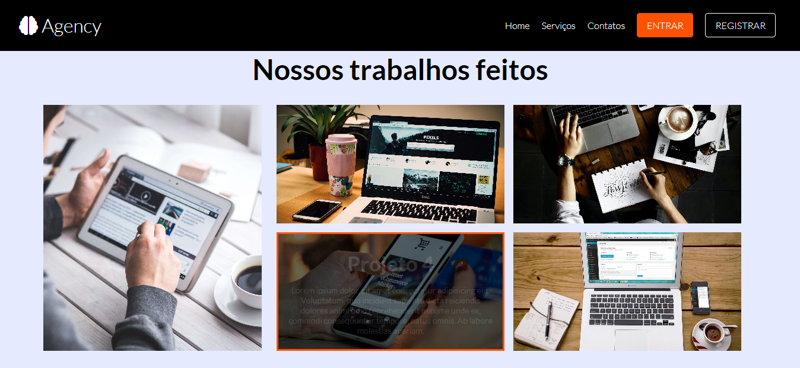
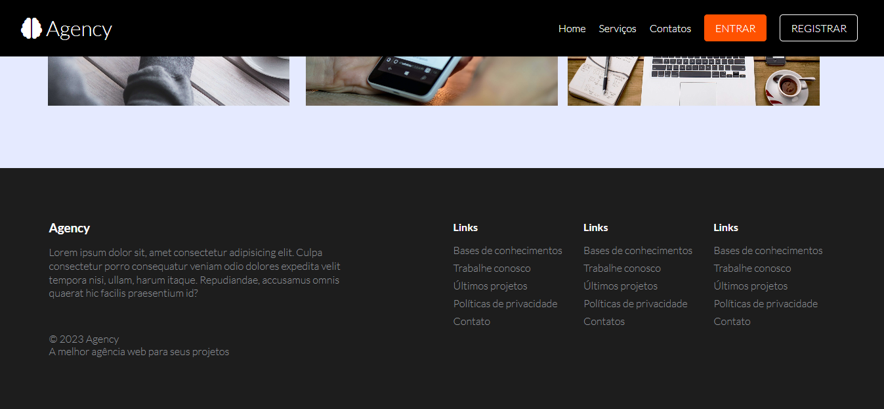

# Agency 🧠

Agency, agência de desenvolvimento de sites/sistemas

  
  
  
  
  

  

## Tecnologias utilizadas no projeto 💻

### `SASS` 🎨

* Nested
* Placeholder Selectors
* Mixins
* Parent Selectors
* Partials

### `Google Fonts` 🎨

* Lato Font

### `Font Awesome` 🎨

* Ferramenta de ícones estilizáveis
